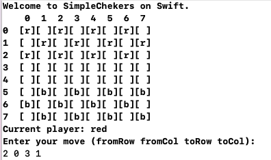
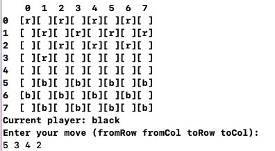
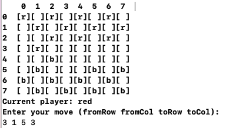
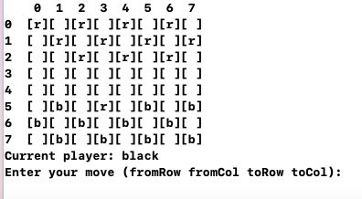

# simpleCheckers (Шашки) with CLI (Command Line Interface)

# Screenshots

## En
This is a simple checkers game that can be played in the command line interface (CLI). 

### Here is an overview of how to play the game:

1. The game starts with a board of 8x8 squares, with alternating red and black squares. The red pieces are placed on the black squares and the black pieces are placed on the white squares.
2. The game is played by two players, one controlling the red pieces and the other controlling the black pieces.
3. Each turn, a player can move one of their pieces one square diagonally. If an opponent's piece is located on the square diagonally across from the player's piece, the player can "capture" the opponent's piece by jumping over it and removing it from the board.
4. The game is won by either capturing all of the opponent's pieces or trapping their remaining pieces so they can no longer make a legal move.
5. To play the game, the player must enter the coordinates of the piece they wish to move and the coordinates of the square they wish to move it to **`for example: 2 0 3 1`**
6. The game will then check if the move is valid, and if so, it will update the board and switch to the next player's turn. If the move is not valid, the player will be prompted to enter a new move.
7. The game will continue until one player wins, or you can stop the game and quit any time.
8. The game will print the board after each move, and it's the player's responsibility to keep track of the game status.

### PieceType
PieceType is an enumeration (enum) that represents the two possible types of pieces in the game: `normal` and `king`.
It happens when piece reaches the opposite end of the board. The opposite end of the board is the last row on the board for the opposing player's pieces. For example, if the piece is a red piece, it will be promoted to a king when it reaches the 8th row of the board. Similarly, if the piece is a black piece, it will be promoted to a king when it reaches the 1st row of the board.

This can be implemented using an if statement inside the move function, where it will check if the piece is on the opposite end of the board, and if so, it will change its type to .king.

Normal pieces are the standard pieces that can only move forward and capture other pieces diagonally.
king pieces are the promoted pieces that can move in any direction and capture other pieces diagonally in any direction.

This code allows to add new types of pieces or rules to the game in the future easily. Additionally, this makes the code more readable and maintainable by giving the developer a clear understanding of the different types of pieces in the game.

It's a simple game and it's easy to learn the rules, but it could be a bit tricky to master. Remember to have fun while playing!
You are always free to improve the game as you see fit, such as adding score tracking.

## Ru
### Простая реализация классической игры Шашки на языке программирования Swift.

1. Игра начинается с доски 8х8 клеток, на которой чередуются красные и черные шашки. Красные фигуры располагаются на черных клетках, а черные – на белых.
2. В игре участвуют два игрока, один контролирует красные фигуры, а другой – черные.
3. Каждый ход игрок может переместить одну из своих фишек на одну клетку по диагонали. Если фигура противника находится на поле по диагонали от фигуры игрока, игрок может «захватить» фигуру противника, перепрыгнув через нее и сняв ее с доски.
4. Игра выиграна либо путем захвата всех фигур противника, либо захватом его оставшихся фигур, чтобы они больше не могли делать разрешенный ход.
5. Чтобы начать игру, игрок должен ввести координаты фигуры, которую он хочет переместить, и координаты клетки, на которую он хочет ее переместить **`например: 2 0 3 1`**
6. Затем игра проверит правильность хода, и если ок, то обновит доску и переключится на ход следующего игрока. Если ход недействителен, игроку будет предложено ввести новый ход.
7. Игра будет продолжаться до тех пор, пока один из игроков не выиграет, или вы можете остановить игру и выйти в любой момент.
8. Игра будет обноалять доску после каждого хода, и игрок несет ответственность за отслеживание статуса игры. 

### Тип шашки
PieceType — это перечисление (enum), представляющее два возможных типа шашки в игре: «обычный» и «король».
Это происходит, когда фигура достигает противоположного конца доски. Противоположный конец доски - это последний ряд на доске для фигур противника. Например, если фигура красная, она превратится в короля, когда достигнет 8-го ряда доски. Точно так же, если фигура черная, она будет превращена в короля, когда достигнет 1-го ряда доски.

Это можно реализовать с помощью оператора if внутри функции перемещения, где она проверяет, находится ли фигура на противоположном конце доски, и если да, то меняет ее тип на .king.

Обычные фигуры — это стандартные фигуры, которые могут двигаться только вперед и бить другие фигуры по диагонали.
Королевские фигуры - это продвинутые фигуры, которые могут двигаться в любом направлении и захватывать другие фигуры по диагонали в любом направлении.

Этот код позволяет легко добавлять новые типы фигур или правил в игру в будущем. Кроме того, это делает код более читабельным и удобным для сопровождения, давая разработчику четкое представление о различных типах элементов в игре.

Это простая игра, и в ней легко выучить правила, но может быть немного сложно освоить ее. Не забывайте получать удовольствие во время игры!
Вы всегда вольны усовершенстовать игру на ваше усмотрение, например добавить отслеживание счета.

